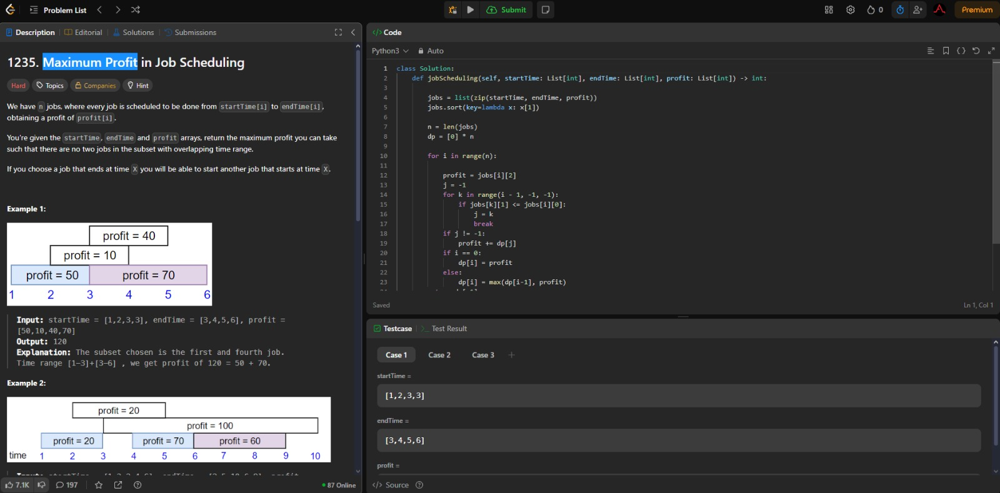
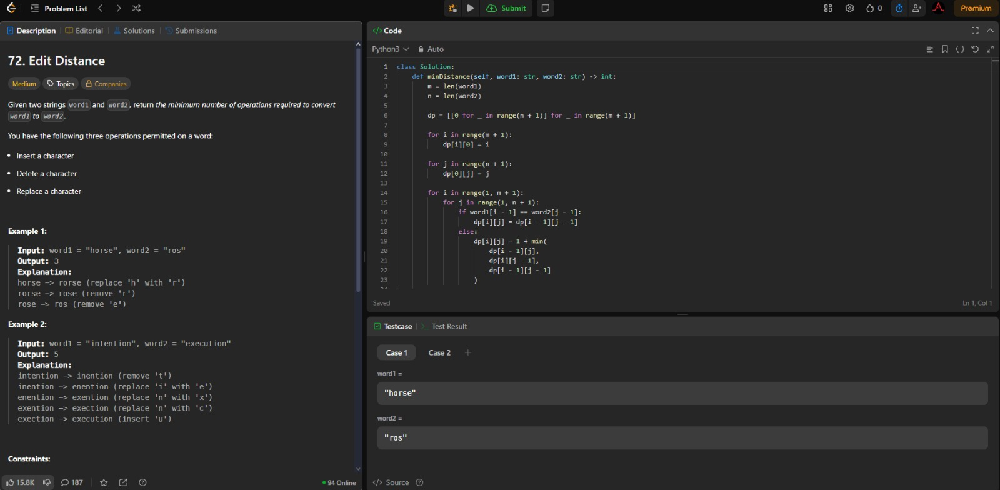
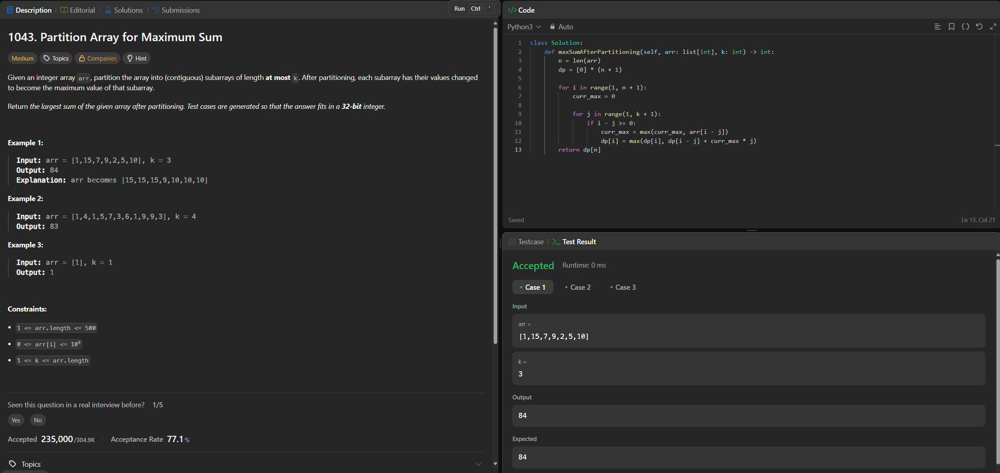
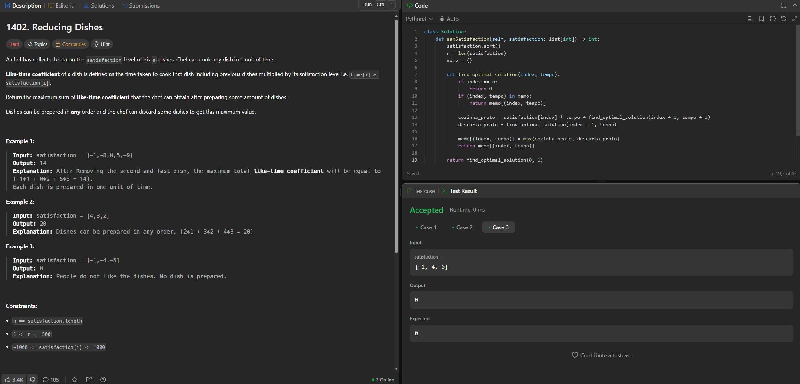

# Programação Dinâmica Leetcode

**Conteúdo da Disciplina**: Programação Dinâmica<br>

## Alunos
|Matrícula | Aluno |
| -- | -- |
| 211031744  |  Júlio César Costa |
| 211031403  |  Marcus Vinicius Cunha Dantas |


## Sobre 
Este projeto visa resolver questões do leetcode relacionadas a algoritimos de Programação Dinâmica com dificuldades médias e difíceis

| Problema | Nome                                   | Dificuldade |
|----------|----------------------------------------|-------------|
| 1235      | [Maximum Profit in Job Scheduling](https://leetcode.com/problems/maximum-profit-in-job-scheduling/description)                        | Difícil       |
|  72    | [Edit Distance](https://leetcode.com/problems/edit-distance/description)                        | Médio     |
| 1043     | [Partition Array for Maximum Sum](https://leetcode.com/problems/partition-array-for-maximum-sum/description/)                        | Médio       |
| 1402    | [Reducing Dishes](https://leetcode.com/problems/reducing-dishes/description/)                        | Difícil     |

## Apresentação

[Apresentação no Youtube](https://youtu.be/2Rvl6ilq9fQ)

## Screenshots

### [Maximum Profit in Job Scheduling](https://leetcode.com/problems/maximum-profit-in-job-scheduling/description)



### [Edit Distance](https://leetcode.com/problems/edit-distance/description)



### [Partition Array for Maximum Sum](https://leetcode.com/problems/partition-array-for-maximum-sum/description/)



### [Reducing Dishes](https://leetcode.com/problems/reducing-dishes/description/)




## Instalação
### Pré Requisitos
Python3.12+
### Comandos
#### Clonagem do Repositório
```git clone https://github.com/projeto-de-algoritmos-2025/PD_Leet.git```
#### Execução
```cd ./PD_Leet```<br>
```python3 [NOME-ARQUIVO].py```


